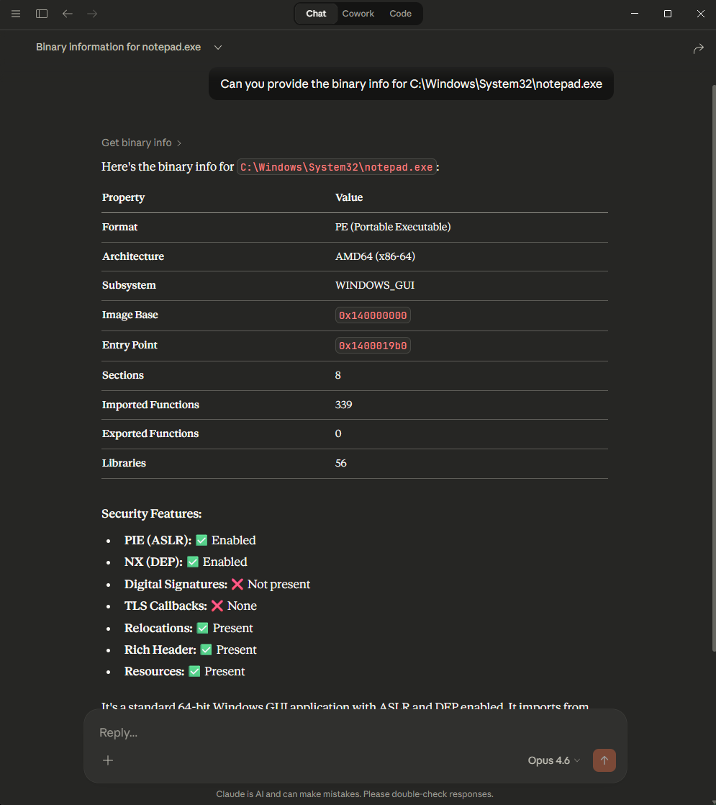

# BinaryAnalysis-MCP


An MCP server for analysing PE, ELF, Mach-O, and COFF binary files using [LIEF](https://lief-project.github.io/).
Pass an absolute file path to any tool and the format is auto-detected.

## Tools

| Tool | Description |
|---|---|
| `get_binary_info` | Quick triage — format, architecture, entry point, section/import/export counts, NX & PIE flags |
| `get_binary_headers` | Full header dump (PE DOS/COFF/Optional, ELF header, Mach-O header) |
| `get_binary_sections` | All sections with name, size, virtual address, entropy, permissions, image base, and entry point |
| `get_binary_imports` | Imported functions grouped by library (PE by DLL, ELF by shared library, Mach-O by dylib) |
| `get_binary_exports` | Exported functions/symbols with ordinals, addresses, and forwarding info |
| `get_binary_libraries` | Dynamic library dependencies (DLLs / shared objects / dylibs) |
| `get_binary_security` | Security hardening — ASLR, DEP/NX, SEH, CFG, RELRO, stack canaries, code signing |
| `get_coff_info` | COFF object file analysis — header, sections, symbols, and relocations |

## Requirements

- Python 3.10+
- Dependencies listed in `requirements.txt`:
  - `mcp[cli]` — Model Context Protocol SDK
  - `lief>=0.17.0` — binary parsing library

## Installation

```bash
git clone https://github.com/Ap3x/BinaryAnalysis-MCP.git
cd BinaryAnalysis-MCP
python -m venv .venv
# Windows
.venv\Scripts\activate
# macOS / Linux
source .venv/bin/activate

pip install -r requirements.txt
```

## Running the server

```bash
python server.py
```

The server communicates over **stdio** using the MCP protocol.

## MCP client configuration

### Claude Desktop

Add the following to your Claude Desktop config file:

- **Windows:** `%APPDATA%\Claude\claude_desktop_config.json`
- **macOS:** `~/Library/Application Support/Claude/claude_desktop_config.json`

```json
{
  "mcpServers": {
    "binary-analysis": {
      "command": "python",
      "args": ["C:/path/to/BinaryAnalysis-MCP/server.py"],
      "env": {}
    }
  }
}
```

If you're using a virtual environment, point directly to the venv Python:

```json
{
  "mcpServers": {
    "binary-analysis": {
      "command": "C:/path/to/BinaryAnalysis-MCP/.venv/Scripts/python.exe",
      "args": ["C:/path/to/BinaryAnalysis-MCP/server.py"],
      "env": {}
    }
  }
}
```

### Claude Code (CLI)

In your project's `.mcp.json`:

```json
{
  "mcpServers": {
    "binary-analysis": {
      "command": "python",
      "args": ["C:/path/to/BinaryAnalysis-MCP/server.py"],
      "env": {}
    }
  }
}
```

### Generic MCP client (stdio)

Any MCP-compatible client can launch the server as a subprocess:

```json
{
  "command": "python",
  "args": ["/absolute/path/to/server.py"],
  "transport": "stdio"
}
```

## Example usage

Once connected, ask your MCP client to call the tools with an absolute file path:



```
Analyse the security hardening of C:\Windows\System32\notepad.exe
```

```
List all imported DLLs for /usr/bin/ls
```

```
Show me the PE headers of C:\Windows\explorer.exe
```

### Example output

**`get_binary_info`** — `C:\Windows\System32\notepad.exe`

```json
{
  "file": "C:/Windows/System32/notepad.exe",
  "format": "PE",
  "entrypoint": "0x1400019b0",
  "imagebase": "0x140000000",
  "is_pie": true,
  "has_nx": true,
  "sections": 8,
  "imported_functions": 339,
  "exported_functions": 0,
  "libraries": 56,
  "machine": "AMD64",
  "subsystem": "WINDOWS_GUI",
  "has_signatures": false,
  "has_tls": false,
  "has_resources": true,
  "has_rich_header": true,
  "has_relocations": true
}
```

**`get_binary_security`** — `C:\Windows\System32\notepad.exe`

```json
{
  "aslr_dynamic_base": true,
  "aslr_high_entropy_va": true,
  "dep_nx_compat": true,
  "seh": true,
  "guard_cf": true,
  "force_integrity": false,
  "appcontainer": false,
  "is_pie": true,
  "has_nx": true,
  "signed": false,
  "format": "PE"
}
```

**`get_binary_sections`** — `C:\Windows\System32\notepad.exe`

```json
{
  "format": "PE",
  "image_base": "0x140000000",
  "entrypoint": "0x19b0",
  "count": 8,
  "sections": [
    {
      "name": ".text",
      "virtual_address": "0x1000",
      "size": 159744,
      "entropy": 6.2826,
      "virtual_size": 157410,
      "sizeof_raw_data": 159744,
      "characteristics": ["CNT_CODE", "MEM_EXECUTE", "MEM_READ"]
    },
    {
      "name": ".rdata",
      "virtual_address": "0x29000",
      "size": 45056,
      "entropy": 5.8039,
      "virtual_size": 42456,
      "sizeof_raw_data": 45056,
      "characteristics": ["CNT_INITIALIZED_DATA", "MEM_READ"]
    },
    {
      "name": ".data",
      "virtual_address": "0x34000",
      "size": 4096,
      "entropy": 1.624,
      "virtual_size": 10048,
      "sizeof_raw_data": 4096,
      "characteristics": ["CNT_INITIALIZED_DATA", "MEM_READ", "MEM_WRITE"]
    },
    {
      "name": ".rsrc",
      "virtual_address": "0x3a000",
      "size": 126976,
      "entropy": 7.0998,
      "virtual_size": 123344,
      "sizeof_raw_data": 126976,
      "characteristics": ["CNT_INITIALIZED_DATA", "MEM_READ"]
    }
  ]
}
```
> *Truncated to 4 of 8 sections for brevity.*

## Project structure

```
server.py              — entrypoint: imports tools, runs mcp
app.py                 — FastMCP instance
helpers.py             — parse_binary, hex_addr, safe_str, safe_enum, format_name, _error
tools/
  __init__.py          — imports all tool modules (triggers @mcp.tool registration)
  info.py              — get_binary_info
  headers.py           — get_binary_headers
  sections.py          — get_binary_sections
  imports.py           — get_binary_imports
  exports.py           — get_binary_exports
  libraries.py         — get_binary_libraries
  security.py          — get_binary_security + _pe_security, _elf_security, _macho_security
  coff.py              — get_coff_info
tests/
  conftest.py          — shared fixtures and sample file paths
  test_helpers.py      — tests for helpers.py utilities
  test_info.py         — tests for get_binary_info
  test_headers.py      — tests for get_binary_headers
  test_sections.py     — tests for get_binary_sections
  test_imports.py      — tests for get_binary_imports
  test_exports.py      — tests for get_binary_exports
  test_libraries.py    — tests for get_binary_libraries
  test_security.py     — tests for get_binary_security
  test_coff.py         — tests for get_coff_info
binary-samples/        — test binaries (git submodule)
.github/workflows/
  tests.yml            — CI: runs pytest on push/PR to main
```

## Pairs well with

This MCP pairs well with [GhidraMCP](https://github.com/LaurieWired/GhidraMCP) — an MCP server that exposes Ghidra's reverse engineering capabilities. Use BinaryAnalysis-MCP for quick static triage (headers, imports, security flags) and GhidraMCP for deeper decompilation and control-flow analysis.

## License

This project is licensed under the [GNU General Public License v3.0](LICENSE).
